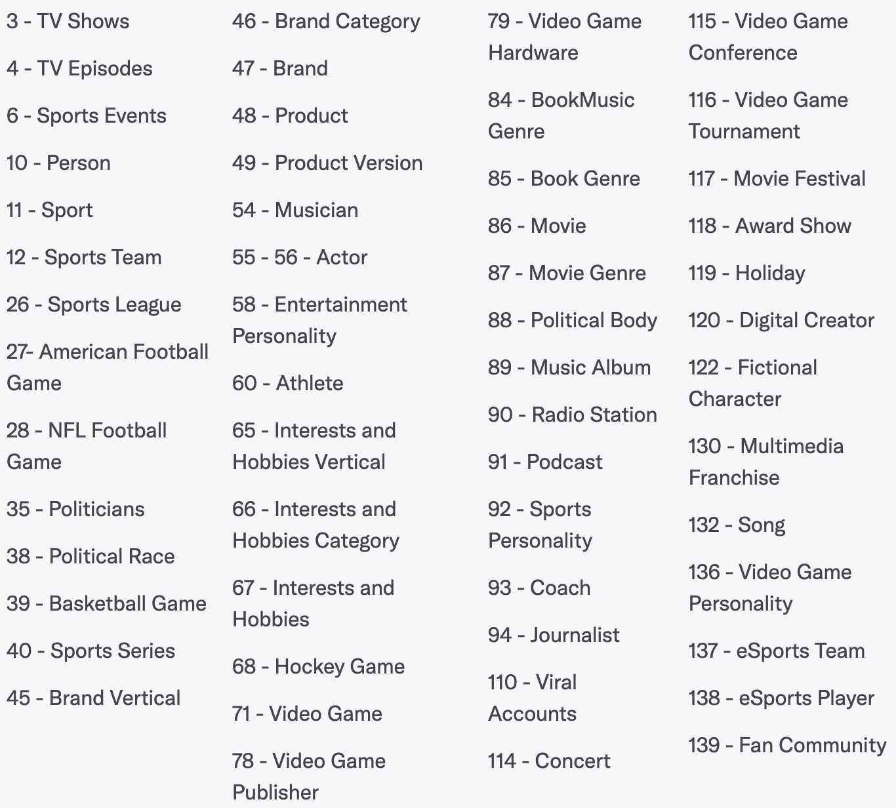

# Deep Learning NLP Project

## Goal
Tweets contain a lot of information regarding different topics. We can agree that you can use multiple key
words to explain a tweet. Twitter's api has an option to return the domain/entity of a tweet.
For example, if we have a tweet: "I took my dog on a walk outside today. We also stopped by the 
store to get groceries", we could label this tweet with different key words like "Pet", "Shopping",
"Outdoors", etc.

We will use this feature the Twitter API provides to collect our training data: tweet and label(s).
We'll then build and train a neural network to classify the tweets. This is a multi label classification problem.

## Data Acquisition
Collect a balanced and unbiased dataset we need to collect tweets randomly. Unfortunately,
Twitter's API does not allow the random collection of historic tweet (there must be some sort
of keyword). However, Twitter allows you to stream random tweets.

We've build a simple script to stream random english tweets to an AWS S3 bucket to build a corpus
of tweets for training. Currently, the stream is collecting about 1,500 tweets every 5 minutes.
After a couple of days we should have a sizable collection of tweets to work with.

Lastly, the tweet stream will be deployed to an AWS EC2 instance for continuous streaming.

### Labels
